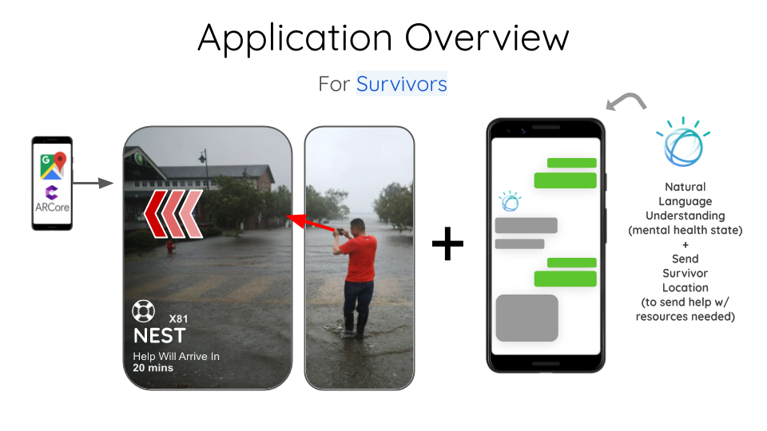
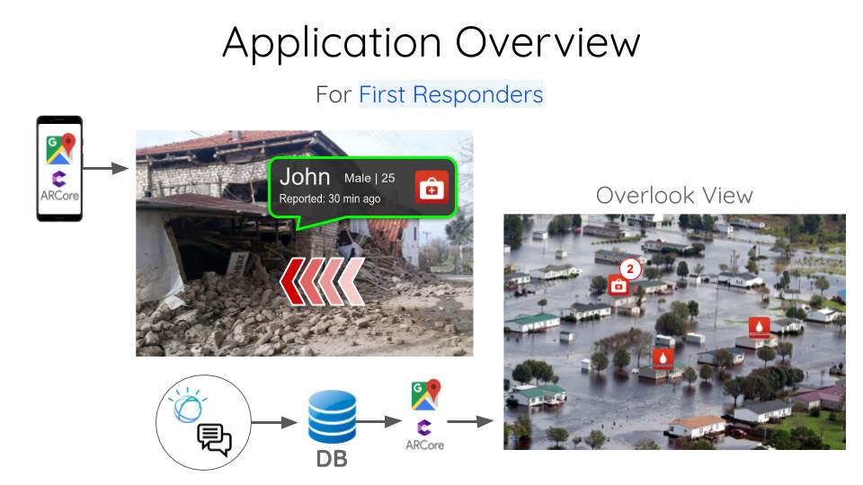
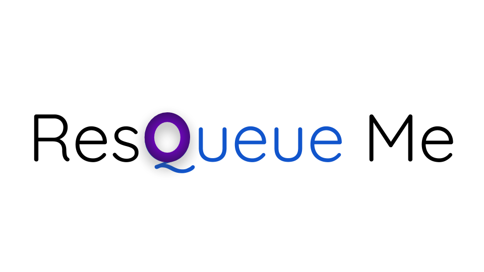

<h1 align="center" style="border-bottom: none;">"ResQueue Me" AR Application</h1>
<h3 align="center">Augmented Reality App to help first responders find survivors and their need during and after natural disasters</h3>

## Inspiration
Water-related disaster events are becoming more frequent and more severe, leading to specific issues for affected communities. Preventing floods and improving our response to them can significantly mitigate the loss of life and property damage. Touch drones can provide real-time data, integration of Augmented Reality (AR) has enormous potential in an application like Requeue Me. Due to natural disasters like an Earthquake and massive flooding, the first responder might have a hard time locating survivors. 

## What it does
"Resqueue Me" uses native AR-Core library and google maps new API to get there location and difficulties they have to inform first responders. On the user's end, IBM Watson virtual assistant asks few questions and collect data which later sent to the cloud. First responders get a notification and a real-time update on their dashboard. Backend services make the location on the map, which will be used as an AR map. Now, the rescue team will use built-in AR technology to search for survivors. In some cases, IBM Watson also suggests nearby rescue camp to survivors so they can rescue themselves. All in all, the primary purpose of this application is to help first responders find survivors as early as possible. 

Give it a try: http://resqueue-me-watson-assistant.mybluemix.net/

## How I built it
* IBM Watson Chatbot: I fed a large JSON file with intents, entities, and dialogs. Later, I deployed Watson chatbot on Cloud foundry so chatbot itself can be utilized in other applications. Locally, Watson chatbot runs on a Node.js server.
* Cross-platform mobile apps: I used Flutter (flutter.dev) framework to create a single code-base cross-platform application for both Android and iOS platform. Now, IBM Watson chatbot is also running in these apps along with a dashboard (Google Map) which displays survivors waiting for help.

## Challenges I ran into
I haven't used any IBM technology before so understanding the workflow, user interface, and technology itself kept me busy for a day or so. Also, I haven't worked with any AR/VR technology, so I had a fun weekend with lots of learning (research-based + tech dev based).

## Accomplishments that I'm proud of
Honestly, coming up with this idea and putting all together was quite interesting. Also, I'm really proud of myself that I trained IBM Watson virtual assistant in a day, and now I know quite a lot about it. As well as, I'm glad that I decided to stick to my gut and develop as much as I could by myself.

## What I learned
IBM Watson Studio, Cloud Foundry App Deployment, AR Core, Google Maps API, and a lot about the effects of natural disasters and what we can do to help others in need and even mitigate it. I always love to work on a social good project and hackathon like BigRed // Hacks who decided to have a social good theme for this season makes me happy and keep exploring!  

## What's next for Requeue Me
I have a long list which is the following:
* Implement Google Maps AR tech into this app (you might have seen that AR street view navigation feature)
* Add predictive ML models to make better decisions on when survivors can rescue themselves
* Send a push notification letting the user know that what are the chances of natural disasters hitting their area and suggest to download AR Map in advance which will have pre-selected rescue camps.
* And many more to come

Note**: I really like the idea that I came up with and I'm looking forward to taking this project further and try to implement these stretch goals.

